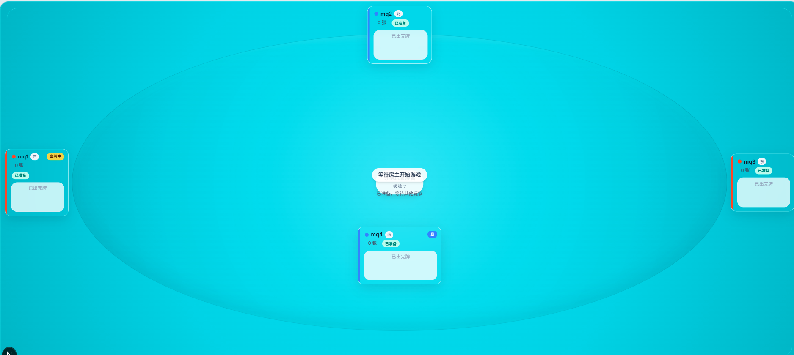

# 掼蛋在线

一个基于 Next.js 15 和 Socket.IO 的四人掼蛋项目，当前重点是“邀请制联网房间”。项目已经具备建房、入房、准备、开局、出牌、结算、进贡/还贡和断线重连能力，适合先在一台公网服务器上部署，直接通过浏览器邀请好友对战。



## 项目现状

- 四人房间流程完整：创建房间、加入房间、准备、房主开局、离房、重新开局
- 对局状态由服务端维护：出牌、不要、轮转、结算、进贡、还贡都在服务端推进
- 已支持匿名身份重连：同一 `clientId` 可在短暂掉线或刷新后回到原座位
- 已补齐联网第一版基础能力：同源 Socket 连接、邀请链接、空房清理、闲置房间过期、基础输入校验、轻量限流
- 当前仍是单进程 + 内存房间模型：服务器重启后房间和对局会丢失，这是第一版的已知边界

## 技术栈

- 前端：Next.js 15、React 18、Tailwind CSS
- 实时通信：Socket.IO
- 服务端：自定义 Node.js 服务，统一承载 Next.js 与 Socket.IO
- 语言：TypeScript + 少量运行时 JS 入口
- 测试：Jest、Playwright

## 快速开始

### 环境要求

- Node.js 18+
- npm

### 安装依赖

```bash
npm install
```

### 本地开发

```bash
npm run dev
```

默认访问地址：

`http://localhost:3003`

本地开发环境下，客户端会直接连接到 `http://localhost:3003` 上的 Socket.IO 服务。

### 生产构建与启动

```bash
npm run build
npm start
```

## Ubuntu 手动部署

如果你准备把当前版本部署到 Ubuntu 单机服务器，建议按“项目目录 + `npm run build` + `npm start` + Nginx 反向代理”的方式落地。

### Ubuntu 服务器 requirements

- Ubuntu 22.04 LTS 或兼容版本
- Node.js 18+
- npm
- Nginx
- 一个可访问的公网域名，并且域名最终会指向这台服务器

### Ubuntu 部署速查

1. 准备项目目录，例如 `/srv/guandan/current`。
2. 把仓库代码放进该目录；如果服务器上已经有仓库，则先 `git pull` 更新到最新提交。
3. 在项目根目录创建 `.env`，可直接从 `.env.example` 复制：

```bash
cp .env.example .env
```

4. 至少确认以下变量已经按真实部署环境填写：

- `HOST=0.0.0.0`
- `PORT=3003`
- `APP_ORIGIN=https://your-domain.example`
- `SOCKET_CORS_ORIGINS=https://your-domain.example`

5. 安装依赖并构建：

```bash
npm install
npm run build
```

6. 运行 Ubuntu 自检脚本，确认部署产物和关键变量都齐全：

```bash
bash scripts/ubuntu-deploy-check.sh
```

7. 启动 Node 服务。最直接的方式是：

```bash
npm start
```

如果你想让进程脱离当前终端，可改用：

```bash
nohup npm start > ./guandan.log 2>&1 &
```

8. 复制并启用 Nginx 模板：

```bash
sudo cp deploy/nginx/guandan.conf.example /etc/nginx/sites-available/guandan.conf
sudo ln -s /etc/nginx/sites-available/guandan.conf /etc/nginx/sites-enabled/guandan.conf
sudo nginx -t
sudo systemctl reload nginx
```

9. 做首轮 smoke test：

- 浏览器访问 `APP_ORIGIN` 对应域名，确认首页可打开
- 创建房间，确认没有立即报错
- 用第二个浏览器或设备打开邀请链接并成功入房
- 确认房间实时状态会同步，说明 `/socket.io/` WebSocket 转发正常
- 刷新任意一名玩家页面，确认能在 `RECONNECT_GRACE_MS` 时间内回到原座位

- 部署总览文档见 [docs/plans/2026-03-04-ubuntu-manual-deploy-runbook.md](/C:/Users/42599/guandan_Game2.0/docs/plans/2026-03-04-ubuntu-manual-deploy-runbook.md)
- Ubuntu 自检脚本见 [scripts/ubuntu-deploy-check.sh](/C:/Users/42599/guandan_Game2.0/scripts/ubuntu-deploy-check.sh)
- Nginx 模板见 [deploy/nginx/guandan.conf.example](/C:/Users/42599/guandan_Game2.0/deploy/nginx/guandan.conf.example)

更完整的目录约定、更新代码方式和问题排查说明见上面的 Ubuntu runbook。

生产环境默认启用“同源 Socket”模式。也就是说，浏览器访问什么域名，Socket.IO 就回连同一个域名，不需要再把前端写死到 `localhost`。

## 联网房间部署

第一版联网房间建议采用“单台公网服务器”部署：

- Node 服务监听 `0.0.0.0`
- 通过公网域名访问站点
- 由 Nginx 或 Caddy 之类的反向代理转发 HTTP 与 WebSocket
- 不做数据库，不做多实例，不做账号系统

### 推荐环境变量

项目已经支持以下部署变量，示例见 [`.env.example`](/C:/Users/42599/guandan_Game2.0/.env.example)：

- `HOST`：服务监听地址。生产建议 `0.0.0.0`
- `PORT`：服务监听端口，默认 `3003`
- `APP_ORIGIN`：站点的公网访问地址，例如 `https://guandan.example.com`
- `SOCKET_CORS_ORIGINS`：允许连接 Socket.IO 的来源列表，多个值用逗号分隔
- `NEXT_PUBLIC_SOCKET_URL`：仅在你需要把客户端 Socket 指向其他域名时才设置；单域名部署通常留空
- `RECONNECT_GRACE_MS`：断线重连保留时长，默认 `30000`
- `ROOM_IDLE_TTL_MS`：空闲等待房间的过期时间，默认 `900000`
- `RATE_LIMIT_WINDOW_MS`：建房/入房限流窗口，默认 `10000`
- `RATE_LIMIT_MAX`：限流窗口内允许的最大请求数，默认 `10`

### 反向代理要求

如果你把项目放在 Nginx、Caddy 或其他网关后面，必须确保它们支持 WebSocket 升级。否则页面能打开，但实时房间事件会失败。

部署时至少要确认：

- 代理到 Node 服务的 HTTP 请求正常
- `/socket.io/` 路径允许 Upgrade / Connection 头透传
- 反向代理和 Node 监听端口一致
- 公网域名与 `APP_ORIGIN`、`SOCKET_CORS_ORIGINS` 配置一致

更完整的单机部署说明见 [docs/plans/2026-03-04-online-multiplayer-deploy-notes.md](/C:/Users/42599/guandan_Game2.0/docs/plans/2026-03-04-online-multiplayer-deploy-notes.md)。

## 常用命令

```bash
# 本地开发
npm run dev

# 单元和组件测试
npm test

# 测试覆盖率
npm run test:coverage

# E2E 测试
npm run test:e2e

# 生产构建
npm run build
```

## 测试与验证

当前仓库覆盖的核心验证包括：

- 运行时配置测试：开发/生产网络配置、同源 Socket、CORS 解析
- 房间生命周期测试：重连、房主转移、空房清理、房间过期
- 联网入口测试：邀请链接、公开入房提示、房间异常提示
- 规则测试：出牌比较、轮次推进、结算、进贡/还贡
- 生产构建验证：Next.js 构建成功

如果你改动了联网房间、Socket 连接或服务端房间逻辑，至少应重新执行：

```bash
npm test
npm run build
```

## 目录结构

```text
app/
  page.tsx
  room/[roomId]/

components/
  HomePage.tsx
  GameRoom.tsx
  game/

hooks/
  useSocket.ts

lib/
  constants.ts
  clientIdentity.ts
  runtime/
  game/

docs/
  layout2.png
  plans/

server.js
```

## 当前边界

第一版联网房间暂不包含以下能力：

- 账号注册与登录
- 快速匹配或排位
- 观战、聊天、好友系统
- 数据库存档与跨重启恢复
- 人机对战或 AI 托管

当前优先目标是先把“公网邀请好友直接开打”做稳，再考虑更重的平台能力。
